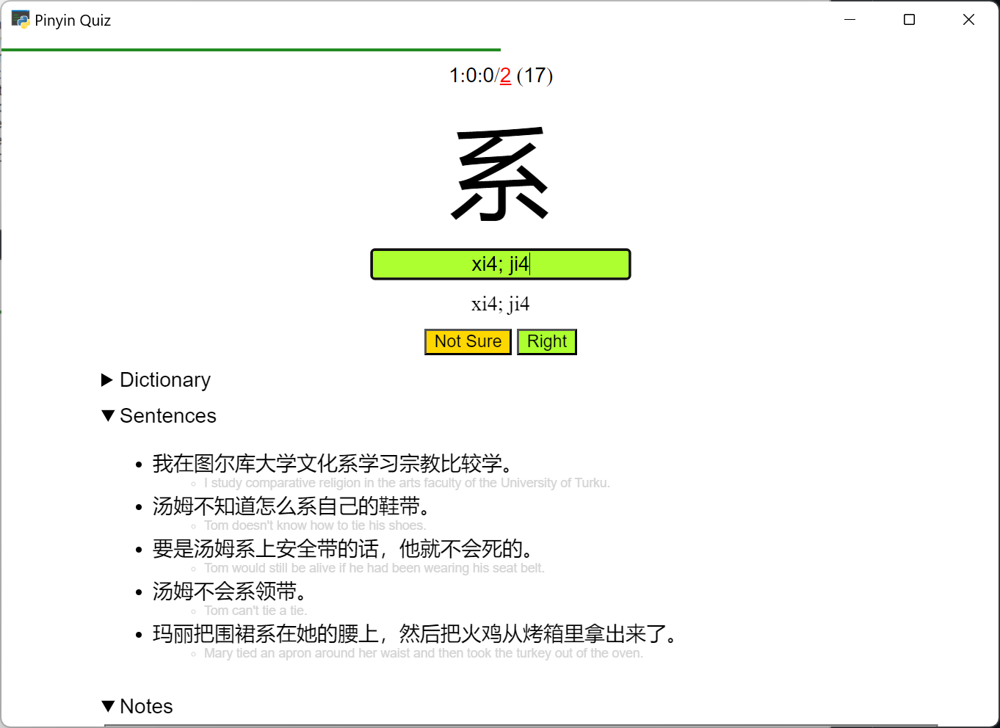
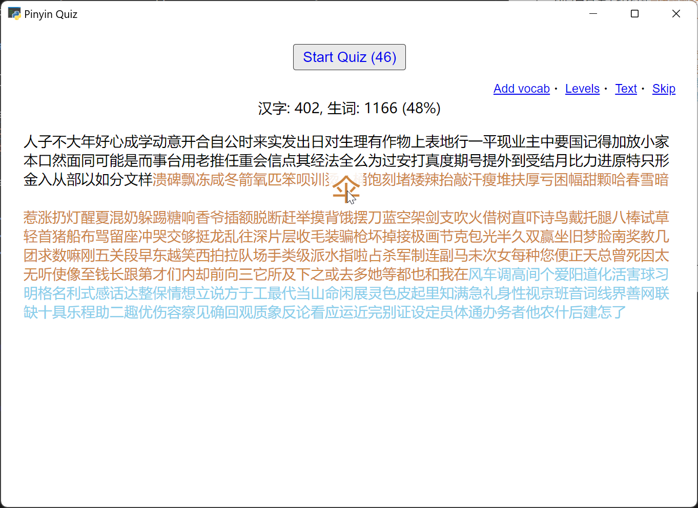

Start with a batch of 20. Will make a new batch if the previous has been surpassed.

After every rounds of not-Right's, there will be unlimited repeat drills until you get everything Right. Additionally, if too many wrongs (10), the repeat drill will start earlier.

No typo checking. However, there is a middle-way button, "Not Sure".

- `ESC` for Not Sure / Skip
- `Ctrl+Z` for undo and redo later (at the end of the queue)
- `F1` or `F5` to end session and start the repeat drill or a new session.
- Mulitple answers if applicable, separated by `;`.
- User vocabularies can be put at `/user/vocab/**/*.txt`, and will be added to Due queue (if the entries exist in [the dictionary](https://www.mdbg.net/chinese/dictionary?page=cc-cedict))
- Skip lists can be put at `/user/skip/**/*.txt`, and will be skipped. For example, if the vocab are accidentally added to the SRS.

## Vocab list ideas

- Hanzi [levels](/assets/zhquiz-level/vocab.yaml) from [ZhQuiz](https://github.com/zhquiz/level/blob/master/_data/generated/vocab.yaml)

## Stats

Technically, only [fsrs](https://pypi.org/project/fsrs/) difficulty < 6 is counted as learned. Accuracy is learned/started.

Hanzi known is calculated from

1. Used in at least 5 vocabularies
2. Learned as a vocabulary with lone or repeated Hanzi
3. Used in at least 3 vocabularies

Progression stats can be seen in the console. Packaged releases also have the console.
